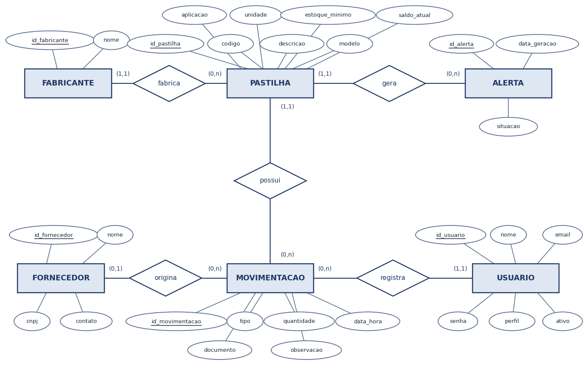
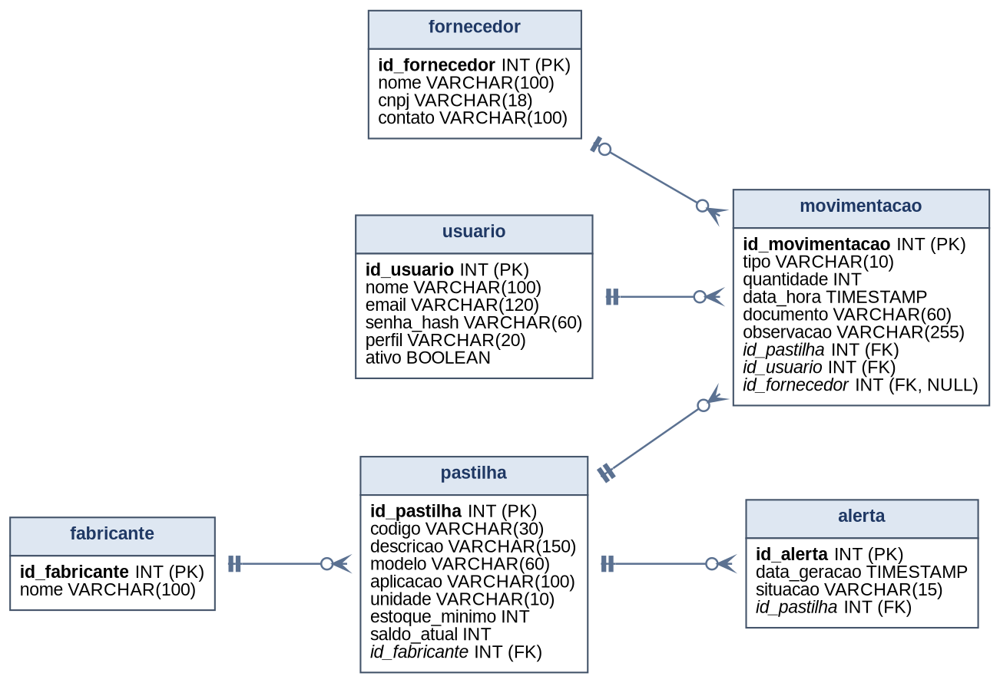

# PasTrack

Sistema web para controle de estoque de pastilhas industriais, desenvolvido na UC Projeto Aplicado IV do Centro Universitário SENAI Santa Catarina, a partir de uma demanda real da DDA Usinagem Industrial publicada na plataforma SAGA SENAI de Inovação.

O sistema substitui o controle em planilhas por registros centralizados: cadastro de pastilhas, fabricantes e fornecedores, entradas e saídas de estoque com validação de saldo, alertas automáticos de estoque mínimo, painel com a situação geral e histórico completo das movimentações.

## Modelagem de dados

O banco do PasTrack foi modelado em duas etapas: primeiro o modelo conceitual,
na notação de Peter Chen, e depois o modelo lógico, já no formato relacional
com as chaves primárias e estrangeiras definidas.

O modelo tem seis entidades. A pastilha é o centro: cada uma pertence a um
fabricante e guarda o estoque mínimo configurado e o saldo atual. A
movimentacao registra tanto as entradas quanto as saídas (campo tipo), sempre
com o usuario responsável pelo lançamento; nas entradas, ela também pode
indicar o fornecedor de origem. Quando o saldo de um item chega ao estoque
mínimo, o sistema gera um registro em alerta, que fica aberto até a reposição.

### Modelo conceitual



### Modelo lógico



A arquitetura em três camadas da aplicação está em [docs/arquitetura.png](docs/arquitetura.png).

## Tecnologias

- Front-end: React + TypeScript (Vite), React Router e Recharts
- Back-end: Node.js + Express + TypeScript
- Banco de dados: PostgreSQL com Prisma ORM
- Autenticação: JWT, com senhas armazenadas em hash (bcrypt)

## Requisitos

- Node.js 20 ou superior
- PostgreSQL 15 ou superior
- Ou apenas Docker com Compose v2, para rodar tudo em containers

## Como rodar com Docker

Sobe o banco, a API e o front-end (servido pelo nginx) com um único comando. Requer Docker com Compose v2.

```bash
cp .env.example .env   # preencha POSTGRES_PASSWORD, JWT_SECRET e SEED_ADMIN_SENHA (instruções no próprio arquivo)
docker compose up -d --build --wait
```

Abra http://localhost:8080 e entre com o e-mail de `SEED_ADMIN_EMAIL` e a senha definida em `SEED_ADMIN_SENHA`. Outros computadores da rede acessam pelo IP desta máquina, na mesma porta (`WEB_PORTA`). A cada subida, a API aplica as migrations pendentes e confere o administrador inicial, sem alterar um que já exista.

O banco fica acessível só nesta máquina, em `localhost:5432` (`DB_PORTA`), para quem quiser rodar a API em modo de desenvolvimento. Para parar, use `docker compose down`; os dados continuam no volume `dados-banco`, que só é apagado com `docker compose down -v`.

## Como rodar o back-end

```bash
cd backend
cp .env.example .env   # preencha JWT_SECRET e SEED_ADMIN_SENHA (instruções no próprio arquivo)
npm install
npm run db:deploy      # aplica as migrations versionadas
npm run db:seed        # cria o administrador inicial
npm run dev
```

A API sobe em http://localhost:3333. O banco pode ser um PostgreSQL local ou o do Docker Compose (`docker compose up -d banco`, com a senha de `POSTGRES_PASSWORD` na `DATABASE_URL`).

## Como rodar o front-end

```bash
cd frontend
cp .env.example .env
npm install
npm run dev
```

A aplicação abre em http://localhost:5173 e encaminha as chamadas de `/api` para a API em http://localhost:3333.

## Acesso inicial

O seed cria um único administrador com o e-mail de `SEED_ADMIN_EMAIL` e a senha de `SEED_ADMIN_SENHA`. Em desenvolvimento, se a senha ficar vazia, o seed gera uma senha aleatória e a exibe uma única vez. Em produção a variável é obrigatória. Rodar o seed de novo nunca altera a senha de um administrador que já existe.

Para carregar dados de demonstração (fabricantes, fornecedores, pastilhas e um usuário de cada perfil), defina `SEED_DEMO=true` no `.env` e rode `npm run db:seed:demo`.

## Estrutura do projeto

```
backend/   API REST organizada em camadas (routes, controllers, services, repositories)
frontend/  SPA React com as telas de login, painel, pastilhas e movimentações
docs/      diagramas do projeto (MER conceitual, MER lógico e arquitetura)
```

## Equipe

- Thiago Araújo
- Fabrício Alves
- Joseph Correa
- Péttrin Miranda
