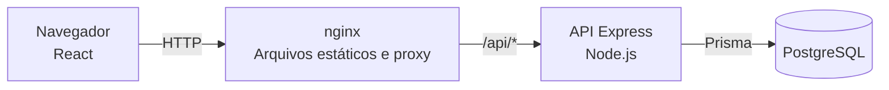

# Arquitetura do PasTrack

## Visão geral

O PasTrack é uma aplicação web para controlar pastilhas industriais. O navegador executa a interface React. O nginx entrega os arquivos da interface e encaminha as chamadas de `/api` para o servidor Express. A API usa Prisma para persistir os dados no PostgreSQL. No Docker Compose, só o nginx aceita conexões da rede; a porta do banco é publicada apenas na máquina que hospeda o sistema.

O contrato das rotas está em [api.md](api.md). O nginx aplica os [cabeçalhos de segurança](../frontend/nginx.conf) e serve o `index.html` nas rotas da interface.

## Camadas da API

As rotas em [`backend/src/routes/`](../backend/src/routes/index.ts) definem os caminhos e encadeiam os controles de acesso e a validação. Os controllers em [`backend/src/controllers/`](../backend/src/controllers/movimentacao.controller.ts) traduzem a requisição HTTP em chamadas de serviço e respostas. Os services em [`backend/src/services/`](../backend/src/services/movimentacao.service.ts) aplicam as regras de negócio e delimitam as transações. Os repositories em [`backend/src/repositories/`](../backend/src/repositories/movimentacao.repository.ts) concentram consultas e gravações comuns com Prisma. Algumas operações transacionais usam o cliente Prisma diretamente no service para manter toda a mudança na mesma transação.

A [matriz de permissões](perfis-e-permissoes.md) define os perfis autorizados por ação. As rotas de consulta são acessíveis aos quatro perfis autenticados. A API mantém o formato dos erros no [tratador central](../backend/src/middlewares/erros.ts).

## Caminho de uma requisição autenticada

1. O nginx encaminha `/api/*` para a API. O Express atribui um identificador à requisição, registra o acesso e aplica os cabeçalhos de segurança e o CORS. As respostas de `/api` saem com `Cache-Control: no-store`. O leitor de JSON aceita corpos de até 100 kB.
2. O router `/api` aplica o limite de requisições por IP e tenta as rotas públicas de saúde e login. O login tem um limite próprio de falhas por IP e e-mail.
3. Para as demais rotas, `autenticar` verifica o token Bearer e revalida a sessão no banco: o usuário precisa existir, estar ativo e ter a mesma versão de token. Trocar a senha, mudar o perfil ou desativar o usuário derruba os tokens emitidos antes, com 401 `SESSAO_INVALIDA`.
4. Em seguida vêm o limite de requisições por usuário e `exigirSenhaAtualizada`, que responde 403 `TROCA_SENHA_OBRIGATORIA` enquanto a senha inicial ou redefinida não for trocada. `GET /api/auth/me` e `PATCH /api/auth/senha` ficam fora dessa exigência, porque servem à troca.
5. Nas rotas com ação restrita, `autorizar` confere o perfil antes da validação. No registro de movimentação, uma checagem adicional recusa a saída de quem só pode registrar entrada.
6. `validar` confere parâmetros, consulta e corpo com Zod. O controller chama o service por meio de `capturar`, que encaminha falhas assíncronas.
7. Uma rota ausente recebe 404. O [tratador de erros](../backend/src/middlewares/erros.ts) converte falhas conhecidas em JSON. Uma falha inesperada vai para o log e responde 500 com o identificador da requisição.

Essa ordem pode ser conferida em [app.ts](../backend/src/app.ts), [routes/index.ts](../backend/src/routes/index.ts), [auth.ts](../backend/src/middlewares/auth.ts), [rate-limit.ts](../backend/src/middlewares/rate-limit.ts), [exigir-senha-atualizada.ts](../backend/src/middlewares/exigir-senha-atualizada.ts) e [validar.ts](../backend/src/middlewares/validar.ts).

## Registro de uma movimentação

O [service de movimentação](../backend/src/services/movimentacao.service.ts) abre uma transação e confirma que a pastilha existe. Numa entrada, confirma também que o fornecedor existe e incrementa `saldo_atual` apenas se o resultado couber no inteiro do banco. Numa saída, decrementa o saldo apenas quando ele cobre a quantidade. A atualização condicional ocorre numa única instrução SQL e trava a linha até o fim da transação. Isso serializa movimentações concorrentes da mesma pastilha.

Após alterar o saldo, o service grava a movimentação e chama [avaliarAlerta](../backend/src/services/estoque/avaliar-alerta.ts) na mesma transação. Com estoque mínimo maior que zero e saldo menor ou igual a ele, abre um alerta se não houver outro aberto. Com saldo acima do mínimo, ou com mínimo zero, resolve automaticamente o alerta aberto. Uma pastilha com estoque mínimo zero nunca gera alerta. O índice único parcial do banco impede dois alertas abertos para a mesma pastilha. A abertura e a resolução automática entram na [auditoria](../backend/src/services/auditoria.service.ts). Se alguma etapa falhar, a transação desfaz todas as mudanças.

## Organização das pastas

| Pasta                                                                                 | Conteúdo                                    |
| ------------------------------------------------------------------------------------- | ------------------------------------------- |
| [`backend/src/routes/`](../backend/src/routes/index.ts)                               | Caminhos da API e sequência de middlewares. |
| [`backend/src/controllers/`](../backend/src/controllers/movimentacao.controller.ts)   | Entrada e saída HTTP.                       |
| [`backend/src/services/`](../backend/src/services/movimentacao.service.ts)            | Regras de negócio e transações.             |
| [`backend/src/repositories/`](../backend/src/repositories/movimentacao.repository.ts) | Consultas e gravações compartilhadas.       |
| [`backend/src/schemas/`](../backend/src/schemas/movimentacao.schema.ts)               | Esquemas de entrada.                        |
| [`backend/src/config/`](../backend/src/config/permissoes.ts)                          | Ambiente, banco e permissões.               |
| [`backend/prisma/`](../backend/prisma/schema.prisma)                                  | Modelo e migrations versionadas.            |
| [`backend/tests/`](../backend/tests/setup/global.ts)                                  | Testes da API.                              |
| [`frontend/src/`](../frontend/src/main.tsx)                                           | Interface React.                            |
| [`scripts/`](../scripts/gerar-doc-perfis.mjs)                                         | Geradores e relatório de testes.            |
| [`tests/results/`](../tests/results/README.md)                                        | Evidências de testes.                       |

## Decisões de arquitetura

Os registros abaixo são entregues pela frente de decisões:

- [ADR-0001 — manter a stack e evoluir](decisoes/ADR-0001-manter-a-stack-e-evoluir.md)
- [ADR-0002 — migrations versionadas e Docker Compose](decisoes/ADR-0002-migrations-versionadas-e-docker-compose.md)
- [ADR-0003 — matriz de perfis e papel do comprador](decisoes/ADR-0003-matriz-de-perfis-e-papel-do-comprador.md)
- [ADR-0004 — validação com Zod como lista de permissão](decisoes/ADR-0004-validacao-com-zod-como-lista-de-permissao.md)
- [ADR-0005 — token no armazenamento local](decisoes/ADR-0005-token-jwt-no-localstorage-como-risco-aceito.md)
- [ADR-0006 — saldo atômico e regras no banco](decisoes/ADR-0006-saldo-atomico-e-regras-no-banco.md)
- [ADR-0007 — resultados de testes versionados](decisoes/ADR-0007-resultados-de-testes-versionados.md)
- [ADR-0008 — ciclo de vida do alerta](decisoes/ADR-0008-ciclo-de-vida-do-alerta.md)
