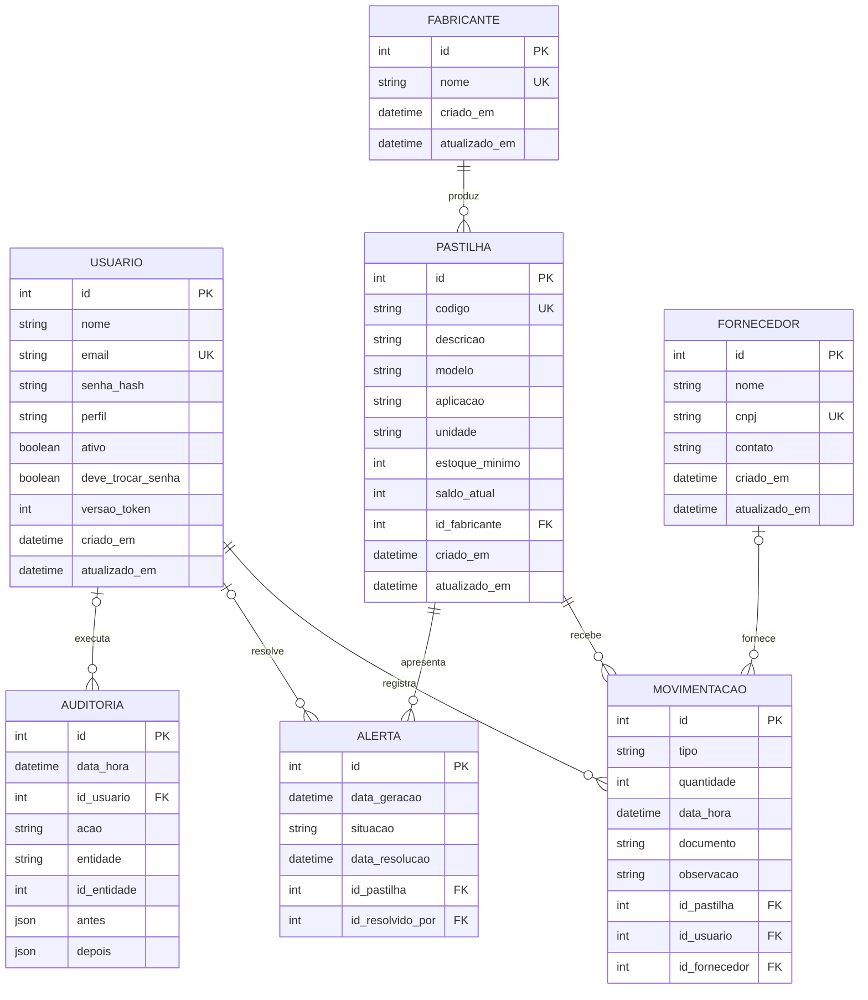

# Banco de dados

O PasTrack usa PostgreSQL 16. O [schema Prisma](../backend/prisma/schema.prisma) define as tabelas, relações e índices comuns. As [migrations](../backend/prisma/migrations/20260914130000_seguranca_integridade/migration.sql) acrescentam regras que o schema Prisma não expressa.

## Relações

O diagrama usa `string` para os três tipos enumerados. No banco, `perfil` é `PerfilUsuario` (`ADMINISTRADOR`, `GESTOR`, `OPERADOR`, `COMPRADOR`), `tipo` é `TipoMovimentacao` (`ENTRADA`, `SAIDA`) e `situacao` é `StatusAlerta` (`ABERTO`, `RESOLVIDO`). As datas são `TIMESTAMP(3)`. As colunas de texto são `TEXT` e os identificadores usam `INTEGER`/`SERIAL`.

## Dicionário de dados

“Sim” na coluna Nulo significa que a coluna aceita `NULL`. “—” em Padrão significa que não há valor padrão. Os nomes são os das colunas físicas.

### `usuario`

| Coluna              | Tipo          | Nulo | Padrão            | Descrição                                                                                     |
| ------------------- | ------------- | ---- | ----------------- | --------------------------------------------------------------------------------------------- |
| `id`                | SERIAL        | Não  | sequência         | Identificador.                                                                                |
| `nome`              | TEXT          | Não  | —                 | Nome exibido.                                                                                 |
| `email`             | TEXT          | Não  | —                 | E-mail único usado no login.                                                                  |
| `senha_hash`        | TEXT          | Não  | —                 | Hash da senha; nunca é devolvido como dado público.                                           |
| `perfil`            | PerfilUsuario | Não  | OPERADOR          | Perfil de acesso.                                                                             |
| `ativo`             | BOOLEAN       | Não  | true              | Permite ou bloqueia o acesso.                                                                 |
| `deve_trocar_senha` | BOOLEAN       | Não  | true              | Obriga a troca no próximo acesso: senha inicial ou redefinida por um administrador.           |
| `versao_token`      | INTEGER       | Não  | 0                 | Sobe a cada troca de senha, desativação ou mudança de perfil e invalida os tokens anteriores. |
| `criado_em`         | TIMESTAMP(3)  | Não  | CURRENT_TIMESTAMP | Criação do registro.                                                                          |
| `atualizado_em`     | TIMESTAMP(3)  | Não  | CURRENT_TIMESTAMP | Atualização feita pelo Prisma.                                                                |

### `fabricante`

| Coluna          | Tipo         | Nulo | Padrão            | Descrição                      |
| --------------- | ------------ | ---- | ----------------- | ------------------------------ |
| `id`            | SERIAL       | Não  | sequência         | Identificador.                 |
| `nome`          | TEXT         | Não  | —                 | Nome único do fabricante.      |
| `criado_em`     | TIMESTAMP(3) | Não  | CURRENT_TIMESTAMP | Criação do registro.           |
| `atualizado_em` | TIMESTAMP(3) | Não  | CURRENT_TIMESTAMP | Atualização feita pelo Prisma. |

### `fornecedor`

| Coluna          | Tipo         | Nulo | Padrão            | Descrição                      |
| --------------- | ------------ | ---- | ----------------- | ------------------------------ |
| `id`            | SERIAL       | Não  | sequência         | Identificador.                 |
| `nome`          | TEXT         | Não  | —                 | Nome do fornecedor.            |
| `cnpj`          | TEXT         | Sim  | —                 | CNPJ único quando informado.   |
| `contato`       | TEXT         | Sim  | —                 | Dados de contato.              |
| `criado_em`     | TIMESTAMP(3) | Não  | CURRENT_TIMESTAMP | Criação do registro.           |
| `atualizado_em` | TIMESTAMP(3) | Não  | CURRENT_TIMESTAMP | Atualização feita pelo Prisma. |

### `pastilha`

| Coluna           | Tipo         | Nulo | Padrão            | Descrição                                                  |
| ---------------- | ------------ | ---- | ----------------- | ---------------------------------------------------------- |
| `id`             | SERIAL       | Não  | sequência         | Identificador.                                             |
| `codigo`         | TEXT         | Não  | —                 | Código único do item.                                      |
| `descricao`      | TEXT         | Não  | —                 | Descrição da pastilha.                                     |
| `modelo`         | TEXT         | Sim  | —                 | Modelo informado no cadastro.                              |
| `aplicacao`      | TEXT         | Sim  | —                 | Aplicação prevista.                                        |
| `unidade`        | TEXT         | Não  | un                | Unidade de medida.                                         |
| `estoque_minimo` | INTEGER      | Não  | 0                 | Limite para alerta; nunca negativo. Zero desliga o alerta. |
| `saldo_atual`    | INTEGER      | Não  | 0                 | Quantidade disponível; só muda por movimentação.           |
| `id_fabricante`  | INTEGER      | Não  | —                 | Referência a `fabricante.id`.                              |
| `criado_em`      | TIMESTAMP(3) | Não  | CURRENT_TIMESTAMP | Criação do registro.                                       |
| `atualizado_em`  | TIMESTAMP(3) | Não  | CURRENT_TIMESTAMP | Atualização feita pelo Prisma.                             |

### `movimentacao`

| Coluna          | Tipo             | Nulo | Padrão            | Descrição                            |
| --------------- | ---------------- | ---- | ----------------- | ------------------------------------ |
| `id`            | SERIAL           | Não  | sequência         | Identificador.                       |
| `tipo`          | TipoMovimentacao | Não  | —                 | Entrada ou saída do estoque.         |
| `quantidade`    | INTEGER          | Não  | —                 | Quantidade positiva movimentada.     |
| `data_hora`     | TIMESTAMP(3)     | Não  | CURRENT_TIMESTAMP | Momento do registro.                 |
| `documento`     | TEXT             | Sim  | —                 | Referência documental.               |
| `observacao`    | TEXT             | Sim  | —                 | Observação livre.                    |
| `id_pastilha`   | INTEGER          | Não  | —                 | Referência a `pastilha.id`.          |
| `id_usuario`    | INTEGER          | Não  | —                 | Referência ao usuário responsável.   |
| `id_fornecedor` | INTEGER          | Sim  | —                 | Referência ao fornecedor da entrada. |

### `alerta`

| Coluna             | Tipo         | Nulo | Padrão            | Descrição                                                        |
| ------------------ | ------------ | ---- | ----------------- | ---------------------------------------------------------------- |
| `id`               | SERIAL       | Não  | sequência         | Identificador.                                                   |
| `data_geracao`     | TIMESTAMP(3) | Não  | CURRENT_TIMESTAMP | Momento da abertura.                                             |
| `situacao`         | StatusAlerta | Não  | ABERTO            | Estado atual.                                                    |
| `data_resolucao`   | TIMESTAMP(3) | Sim  | —                 | Momento do fechamento.                                           |
| `id_pastilha`      | INTEGER      | Não  | —                 | Referência à pastilha monitorada.                                |
| `id_resolvido_por` | INTEGER      | Sim  | —                 | Usuário que resolveu manualmente; nulo no fechamento automático. |

### `auditoria`

| Coluna        | Tipo         | Nulo | Padrão            | Descrição                                  |
| ------------- | ------------ | ---- | ----------------- | ------------------------------------------ |
| `id`          | SERIAL       | Não  | sequência         | Identificador.                             |
| `data_hora`   | TIMESTAMP(3) | Não  | CURRENT_TIMESTAMP | Momento da ação.                           |
| `id_usuario`  | INTEGER      | Sim  | —                 | Usuário que realizou a ação, quando há um. |
| `acao`        | TEXT         | Não  | —                 | Nome da ação registrada.                   |
| `entidade`    | TEXT         | Não  | —                 | Tipo do registro afetado.                  |
| `id_entidade` | INTEGER      | Não  | —                 | Identificador do registro afetado.         |
| `antes`       | JSONB        | Sim  | —                 | Estado anterior filtrado.                  |
| `depois`      | JSONB        | Sim  | —                 | Estado posterior filtrado.                 |

A [rotina de auditoria](../backend/src/services/auditoria.service.ts) remove senha, hash, senha temporária e versão do token dos objetos antes de gravar `antes` e `depois`. Não há rota pública para consultar essa tabela. A gravação da auditoria usa a mesma transação da mudança.

## Restrições e índices

A [migration de integridade](../backend/prisma/migrations/20260914130000_seguranca_integridade/migration.sql) cria três restrições `CHECK`:

| Restrição                              | Condição              |
| -------------------------------------- | --------------------- |
| `pastilha_saldo_nao_negativo`          | `saldo_atual >= 0`    |
| `pastilha_estoque_minimo_nao_negativo` | `estoque_minimo >= 0` |
| `movimentacao_quantidade_positiva`     | `quantidade > 0`      |

O índice único parcial `alerta_aberto_por_pastilha` cobre `alerta(id_pastilha)` apenas quando `situacao = 'ABERTO'`. Assim, uma pastilha pode ter vários alertas resolvidos, mas no máximo um aberto. A migration resolve duplicações antigas antes de criar o índice. As demais chaves únicas, índices e relações estão no [schema](../backend/prisma/schema.prisma). Uma exclusão de fornecedor ou de usuário responsável por resolução deixa a respectiva chave opcional como nula; as relações obrigatórias impedem excluir registros ainda referenciados.

## Política de migrations

As migrations são versionadas em [`backend/prisma/migrations/`](../backend/prisma/migrations/20260914120000_inicial/migration.sql). Crie uma migration a partir do `backend/` com `npx prisma migrate dev --create-only --name nome_da_mudanca`, revise o SQL gerado e acrescente nele as regras do PostgreSQL que o Prisma não representa. Não edite migrations já aplicadas em ambientes compartilhados.

Confira a equivalência entre migrations e schema com `npm run db:verificar`, após definir `SHADOW_DATABASE_URL` para um banco de sombra descartável. O [verificador](../backend/scripts/verificar-migrations.mjs) aceita apenas a diferença intencional do índice parcial. A implantação usa `npm run db:deploy`.

Para um banco preexistente que já reproduz a migration inicial, registre o baseline antes de aplicar as migrations seguintes: `npx prisma migrate resolve --applied 20260914120000_inicial`. Confira o esquema existente antes desse passo; em um banco vazio, aplique todas as migrations normalmente.
