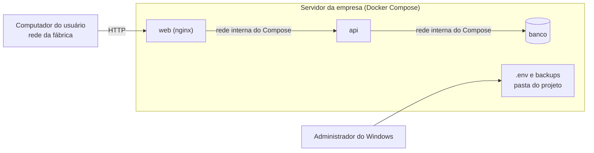

# Modelo de ameaças

Levantamento das ameaças consideradas no PasTrack, do jeito que ele é instalado: um servidor na rede local da fábrica, com Docker Compose, acessado pelos computadores do chão de fábrica e do escritório.

A resposta a cada ameaça está na [documentação de segurança](../seguranca.md), e a conformidade linha a linha na [autoavaliação ASVS](asvs-l1-checklist.md).

## O que o sistema guarda

| Dado                                     | Onde                       | Por que importa                                       |
| ---------------------------------------- | -------------------------- | ----------------------------------------------------- |
| Nome e e-mail dos usuários               | tabela `usuario`           | Dado pessoal de funcionário, protegido pela LGPD      |
| Hash da senha                            | tabela `usuario`           | Permite acesso ao sistema se for quebrado             |
| Estoque, movimentações, custos indiretos | `pastilha`, `movimentacao` | Informação operacional da empresa e base para compras |
| Trilha de auditoria                      | tabela `auditoria`         | Quem fez o quê; sustenta a apuração de um desvio      |
| Segredos da instalação                   | arquivo `.env`             | Dá acesso total ao banco e permite forjar tokens      |

## Fronteiras

A rede da fábrica é a fronteira principal: tudo que chega ao nginx vem de alguém que já está nela. O banco e a API não aceitam conexão de fora do servidor; só a porta do site é publicada, e a do banco fica restrita à própria máquina.

## Quem pode atacar

| Agente                             | Motivação                                      | Acesso que já tem                        |
| ---------------------------------- | ---------------------------------------------- | ---------------------------------------- |
| Funcionário com conta              | esconder uma perda, alterar saldo, bisbilhotar | login válido, perfil limitado            |
| Funcionário sem conta, na rede     | curiosidade, acesso indevido                   | alcança o site pela rede                 |
| Ex-funcionário                     | retaliação, uso do acesso antigo               | possivelmente uma conta não desativada   |
| Visitante ou terceiro na rede      | oportunidade                                   | alcança o site se a rede não for isolada |
| Software malicioso num posto       | roubo de credencial e de sessão                | o navegador do usuário                   |
| Quem tem acesso físico ao servidor | cópia de dados                                 | disco, `.env` e backups                  |

Ataque vindo da internet fica fora do escopo enquanto o sistema não for publicado. Se um dia for, a primeira providência é TLS, tratada em [seguranca.md](../seguranca.md).

## Ameaças, por categoria

A classificação segue o STRIDE.

### Falsificação de identidade

| Ameaça                                                 | Resposta                                                                                  |
| ------------------------------------------------------ | ----------------------------------------------------------------------------------------- |
| Adivinhar a senha de alguém por tentativa e erro       | Limite de 5 falhas por IP e e-mail a cada 15 minutos, com 429 e `Retry-After`             |
| Usar a senha inicial publicada num manual antigo       | Não existe senha padrão: a inicial vem do `.env` e precisa ser trocada no primeiro acesso |
| Aproveitar a conta de quem saiu da empresa             | Desativar o usuário derruba os tokens dele na hora, sem esperar a expiração               |
| Forjar um token                                        | Assinatura HS256 com segredo de 32 caracteres ou mais, recusado no boot se for fraco      |
| Reaproveitar um token antigo depois da troca de senha  | A versão do token muda e os anteriores respondem 401 `SESSAO_INVALIDA`                    |
| Descobrir quais e-mails existem pelo tempo de resposta | Login sempre compara contra um hash, mesmo sem usuário, e a mensagem de erro é a mesma    |

### Adulteração

| Ameaça                                               | Resposta                                                                                            |
| ---------------------------------------------------- | --------------------------------------------------------------------------------------------------- |
| Mudar o saldo direto pelo cadastro, sem movimentação | O saldo não é campo de cadastro, e os esquemas recusam campo desconhecido                           |
| Mandar campo a mais para escalar privilégio          | Zod como lista de permissão em corpo, parâmetros e consulta                                         |
| Duas saídas ao mesmo tempo deixando o saldo negativo | A atualização é condicional, numa instrução só, e trava a linha até o fim da transação              |
| Apagar o histórico para esconder um desvio           | A API não expõe exclusão de movimentação; a correção é um lançamento inverso, que fica no histórico |
| Injeção de SQL                                       | Prisma com consulta parametrizada, inclusive na única consulta crua                                 |

### Repúdio

| Ameaça                                    | Resposta                                                                   |
| ----------------------------------------- | -------------------------------------------------------------------------- |
| "Não fui eu que dei baixa nessa pastilha" | Toda movimentação guarda o usuário, a data e a hora                        |
| "Não fui eu que mudei esse cadastro"      | A trilha de auditoria guarda antes e depois, na mesma transação da mudança |
| Conta compartilhada entre o turno inteiro | Risco de processo, não de software: o manual pede uma conta por pessoa     |

### Vazamento de informação

| Ameaça                                                  | Resposta                                                                                             |
| ------------------------------------------------------- | ---------------------------------------------------------------------------------------------------- |
| Ler o tráfego na rede da fábrica                        | **Não tratado na instalação padrão**: é HTTP. Veja o risco aceito em [seguranca.md](../seguranca.md) |
| Erro do servidor revelando detalhe interno              | O 500 responde só com a mensagem genérica e um identificador para o log                              |
| Senha ou token indo parar no log                        | O logger redige cabeçalho de autorização e campos de senha                                           |
| Backup esquecido numa pasta compartilhada               | O guia manda restringir a pasta do projeto e tratar o backup como segredo                            |
| Cache do navegador guardando resposta com dado sensível | As respostas de `/api` saem com `Cache-Control: no-store`                                            |
| Roubo do token pelo `localStorage` via script           | CSP sem origem externa e sem ponto de injeção de HTML no código; risco aceito no ADR-0005            |

### Negação de serviço

| Ameaça                               | Resposta                                                      |
| ------------------------------------ | ------------------------------------------------------------- |
| Varredura ou robô consumindo a API   | Limite por IP antes do login e por usuário depois dele        |
| Corpo gigante para derrubar a API    | O corpo é limitado a 100 kB, e o nginx corta em 1 MB          |
| Consulta que devolve o banco inteiro | A página tem no máximo 100 registros                          |
| Disco cheio de log                   | O Compose limita o tamanho dos arquivos de log dos containers |

### Elevação de privilégio

| Ameaça                                                                       | Resposta                                                                                   |
| ---------------------------------------------------------------------------- | ------------------------------------------------------------------------------------------ |
| Operador chamando a API direto para cadastrar pastilha                       | A permissão é conferida no servidor, não na tela                                           |
| Usuário mudando o próprio perfil                                             | Perfil só muda pela rota de administração, e o esquema da própria conta não aceita o campo |
| Último administrador desativado, deixando o sistema sem dono                 | A API recusa desativar ou rebaixar o último administrador ativo                            |
| Administrador redefinindo a própria senha para contornar a troca obrigatória | A API recusa a redefinição da própria conta pela gestão de usuários                        |

## O que fica de fora

- **Ataque vindo da internet**, enquanto o sistema não for publicado.
- **Máquina do usuário comprometida**: com o navegador sob controle do atacante, a sessão daquele usuário se perde. A resposta é desativar a conta e trocar a senha.
- **Servidor comprometido no nível do sistema operacional**: quem tem administrador do Windows lê o `.env` e o banco.
- **Ameaça interna com acesso ao banco**: quem tem a senha do PostgreSQL altera dados sem passar pela API. A trilha de auditoria não protege contra isso.

Essas quatro dependem de controles fora do software: rede isolada, antivírus e política de acesso ao servidor. O [guia de implantação](../deploy.md) e o [manual de operação](../operacao.md) dizem o que a empresa precisa fazer.
